# Deploy Java application to GCP Cloud Run with Maven, Jib & Cloud Build
Use GitHub -> Cloud Build -> Container Registry -> Cloud Run

Created by Quan Le Trong (https://github.com/quanltsimple)
# Solution Description
## System Architecture

## Architecture diagram

This solution can be deployed for all account & region of Google Cloud Platform

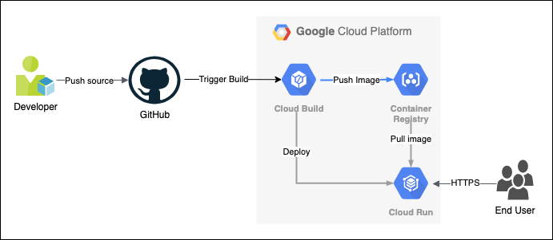

## Components

### Jib

- Jib builds optimized Docker and OCI images for your Java applications without a Docker daemon - and without deep mastery of Docker best-practices. It is available as plugins for Maven and Gradle and as a Java library.

### Cloud Build
- Cloud Build is Serverless CI/CD platform use for Build, test, and deploy of GCP

### Cloud Run
- Develop and deploy highly scalable containerized applications on a fully managed serverless platform form GCP

## Deployment Instructions

### Deployment prerequisites

- First you need to install Google Cloud SDK (If you want to deploy from Locally)

```
https://cloud.google.com/sdk/docs/install
```

- Login to GCP with command (If you want to deploy from Locally)
```
gcloud login
```

- Please make sure that the GCP account has execute permission to Cloud Build
- Created Cloud Run with your name want with Hello World container demo from GCP

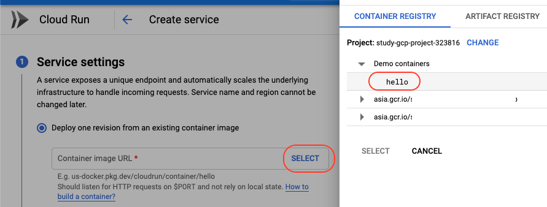

- Create your new bucket for save maven cache

- Add permission execute Cloud Run for Cloud Build, access to Cloud Build console -> click Setting menu -> Enable Cloud Run

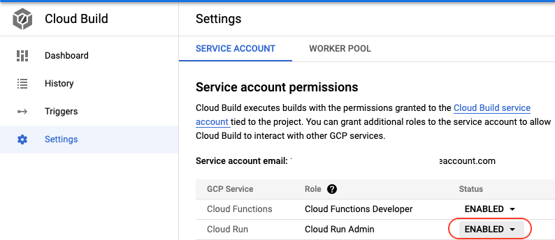

- Modify config in cloudbuild.yml, change all value in "substitutions" with your value

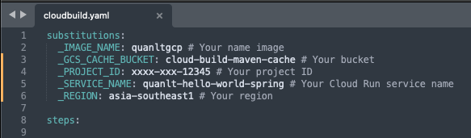

- Modify config in pom.xml, fill your Java version & tag for container image

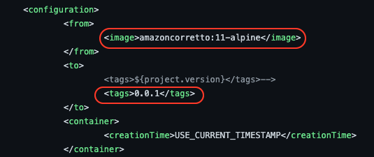

## Deploy to GCP from gcloud command Locally

- Run the command below in your project folder
```
gcloud builds submit
```

## Check result

- Access to Cloud Run console -> Click your service -> Click to your service link

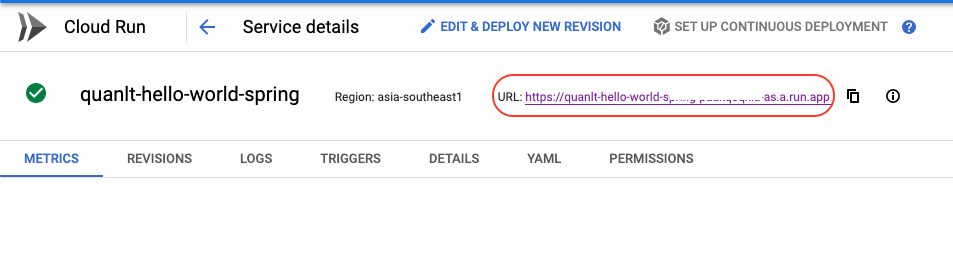

## Setup automation trigger with Cloud Build & GitHub

- Access to Cloud Run console -> click Trigger -> click Create Trigger -> in option Source click "Connect New Repository" -> Select GitHub and click Continue to grant GitHub access to Cloud Build

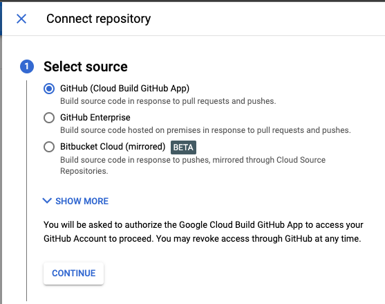

- Install Google Cloud Build for your GitHub account if you don't have it, click "Install Google Cloud Build", Cloud Run will support you to install

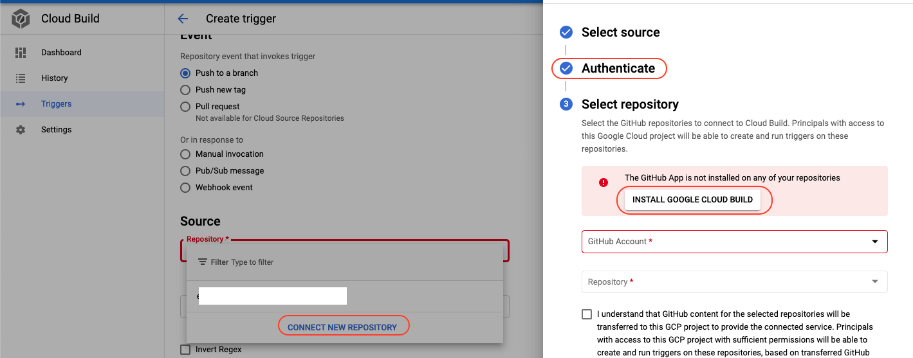

- Accept install Google Cloud Build

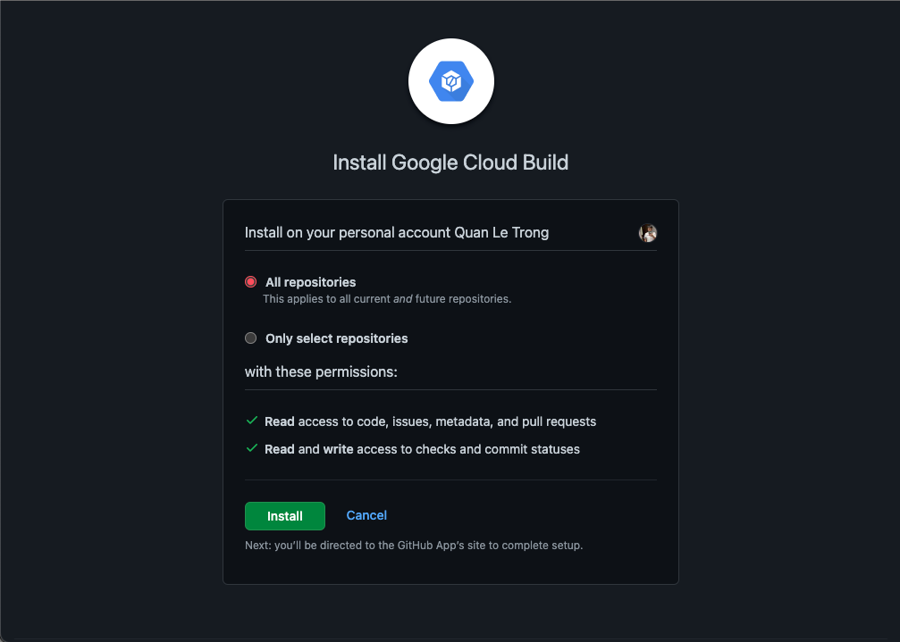

- Select your GitHub Account & Your project Java in GitHub

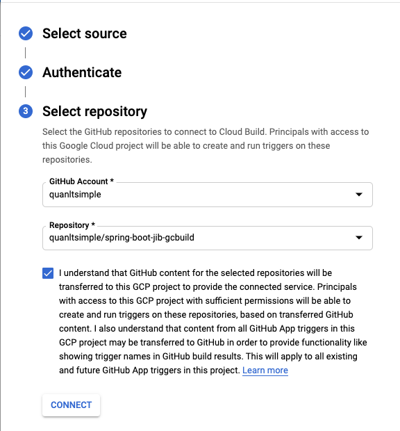

- Select the branch that you want the trigger to automatically build as soon as there is a change, normally it will be main, develop or master

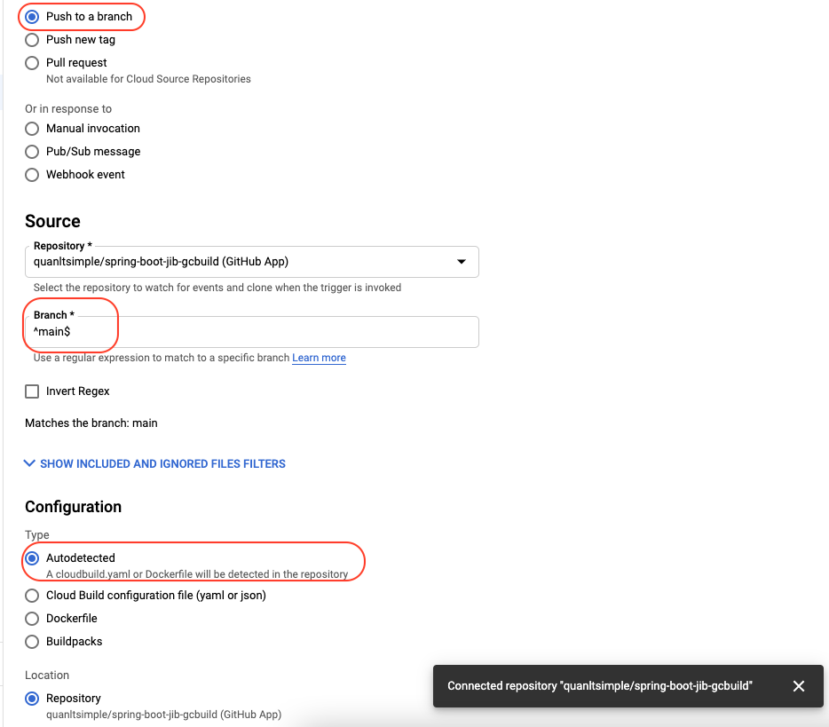

- Setup Trigger done

- Now, Try changing something and commit to your branch, then go to the Cloud Build console. Wow, enjoy if all goes well

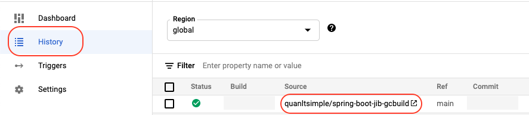

- Now, whenever there is a change on your branch, Cloud Build will automatically build at that time
